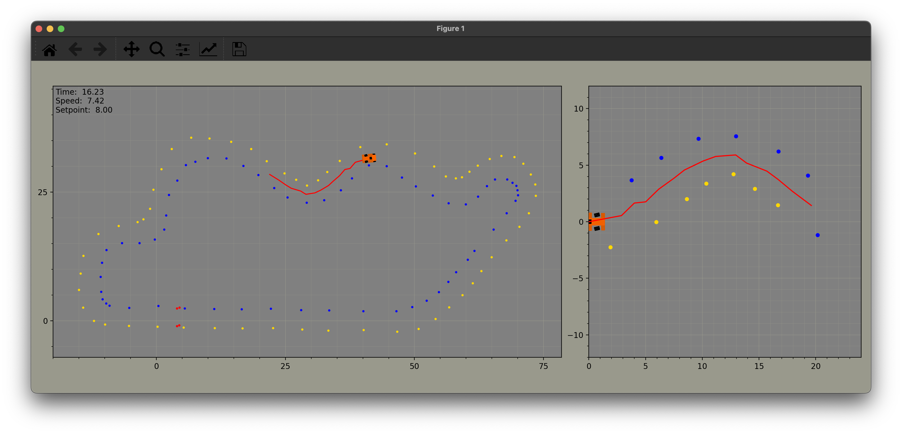
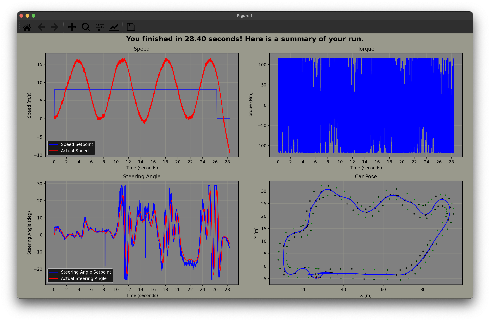

# eForce Driverless 2024 newbie task - DV μ-sim

## Introduction

The main use of this miniature simulator is to give space for the newbies in Formula Student team, eForce Prague Formula, to get familiar with our ecosystem and to uleash their creativitiy along with competitive spirit, as these values define the core values of the Formula Student competition. We have decided to release the microsim to the public, creating an opportunity for anyone to calibrate and develop upon our basic stack.

## Installation

1. Clone this repository onto a machine with Linux or macOS, do it over [SSH](https://phoenixnap.com/kb/git-clone-ssh) for easier access (that is what you will be using once you start developing the full system)
1.5. Cloning the repository for Windows system is possible, however you must first install WSL (Windows Subsystem for Linux) and requires a little longer setup. 
3. Make sure to have python >= 3.10 installed (ideally 3.11 - 3.12). On macOS, use [homebrew](https://brew.sh/) exclusively for all packages. On Ubuntu, install it using [deadsnakes](https://launchpad.net/~deadsnakes/+archive/ubuntu/ppa). Other Linux distros usually have good package managers with latest python versions (Fedora, Manjaro, Arch).
4. Activate you venv if applicable or make sure your python is aliased under `python`
5. Run `python -m pip install -r requirements.txt` to install the required packages
6. run `python run.py` to start the simulation with evaluation

While the animation is running, you can press `q` to hide it or `e` to quit the whole program. After the simulation, a summary panel is shown. Press any key to close it and continue with the next map. You can press `s` to save the summary plot to an image.

## Structure

- `run.py` - Main runner script for the simulation
- `gains.py` - PID controller gains, **which you will be tuning**
- `mission.py` - Mission file for the simulation, **which you will be implementing**
- `bin/` - Contains the binary files for the simulator
- `helpers/` - Contains all driverless algorithms and simulator code
- `maps/` - Contains all the maps for the simulator

While running the simulation, a log folder will be automatically created with csv files containing logs of the simulation for each of the maps.
You can disable this by running the simulation with the `--no_log` flag.

## Task

1. Implement the `mission.py` file to successfully drive around the track
2. Tune the PID controller in the `gains.py` file to achieve the best performance
3. Be the fastest around the track!

### Tips

1. Fix the PID controller first
2. Tune the path tracking constants
3. Improve, reimplement or keep the path planning algorithm
4. Think about how you could improve the path for the speed planning algorithm (adding more points?)

Have fun!

## Helpful resources

1. https://thomasfermi.github.io/Algorithms-for-Automated-Driving/Control/ControlOverview.html
2. https://www.ni.com/en/shop/labview/pid-theory-explained.html
3. https://blogs.mathworks.com/student-lounge/2022/10/03/path-planning-for-formula-student-driverless-cars-using-delaunay-triangulation/
4. https://www.youtube.com/watch?v=U6vr3iNrwRA&list=PLgnQpQtFTOGQrZ4O5QzbIHgl3b1JHimN_
5. https://numpy.org/
6. https://docs.python.org/3.11/
7. https://dspace.cvut.cz/handle/10467/101617
